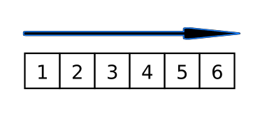
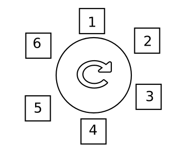

# Vetor Circular
Repositório de referência para estudo e aplicação de conhecimentos referentes a Vetores Circulares - Desenvolvido durante a disciplina de EDB1 - da Universidade Federal do Rio Grande do Norte

## Fundamentação

Dada uma estrutura não circular sendo percorrida, nenhuma posição aquém de uma dada posição N pode ser alcançada incrementalmente.

A fim de sanar essa impossibilidade e utilizando de conceitos matemáticos triviais como '%'- mod podemos tornar essa estrutura em algo cíclico e facilmente manipulável

## Exemplificação

A fim de demonstrar uma estrutura pronta utilizando esse conceito temos um notebook que o guiará nos passos desse entendimento.

[Notebook - Estrutura Circular]()